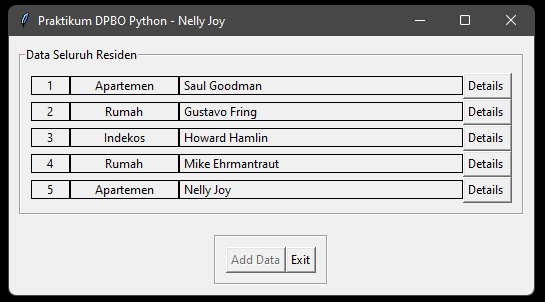
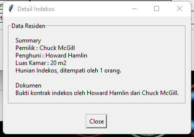
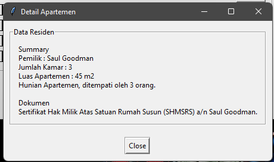
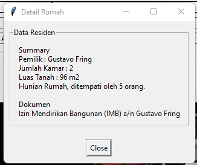

## LATIHAN 9 DPBO 2022

Janji

>Saya Nelly Joy Christi Simanjuntak 2000199 mengerjakan Latihan 9 dalam mata kuliah Desain dan Pemrograman Berorientasi Objek untuk keberkahanNya maka saya tidak melakukan kecurangan seperti yang telah dispesifikasikan. Aamiin

#### Latihan 9 - Python GUI
Pada tugas ini terdapat source code Python yang telah diperbaiki fiturnya. Berikut penjelasan mengenai apa yang telah saya kerjakan beserta dokumentasi hasilnya.

1. Tampilan awal
   > 
2. Tampilan ketika klik tombol detail, terdapat tombol 'Close' untuk menutup window, menampilkan data pemilik, dan menampilkan data dokumen dari hunian.
   - Detail Indekos (tambahan menampilkan data penghuni) 
     
   - Detail Apartemen (tambahan menampilkan data jumlah kamar)  
     
   - Detail Rumah (tambahan menampilkan data jumlah kamar)  
     
3. Menambahkan atribut luas yang ditampilkan juga pada detail.
   >Hasil dokumentasi terdapat pada poin 2 (ditampilkan atribut luas)
4. Hasil menjalankan program dan menampilkan detail.
   >Berikut Video hasil program. 
   

https://user-images.githubusercontent.com/99189201/163861078-9830660b-ef61-4124-b012-41c833584bc2.mp4

   

   

###### Sekian tugas saya, mohon maaf apabila masih terdapat banyak kesalahan atau kekurangan. Terima kasih.
